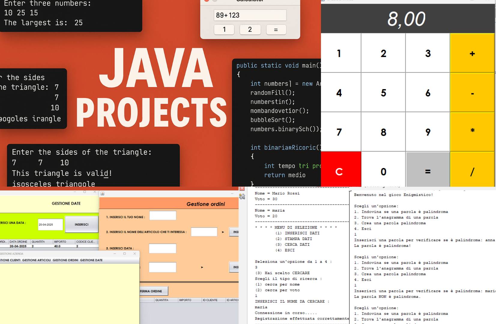

# 🚀 Java Projects Collection — Beginner to Intermediate



# 📚 Java Projects Collection

Benvenuto in questa collezione di progetti Java suddivisi per tipo di interfaccia e scopo didattico. Troverai applicazioni grafiche con **Swing**, progetti con interazione a **Database**, e programmi **console** per esercitazioni di base.

---

## 📁 Struttura dei Progetti

# 📚 Java Projects Collection

Benvenuto! Questa repository raccoglie vari progetti Java suddivisi per categoria: interfacce grafiche (Swing), applicazioni con database e programmi console. Tutti i progetti si trovano direttamente nella directory principale.

---

## 🗃️ Database
- [DatabaseSchoolCRUD](DatabaseSchoolCRUD/) — CRUD su database scolastico (MySQL).
- [DatabaseScuola](DatabaseScuola/) — Progetto con connessione a DB scuola.
- [DatabaseUniversitaClassi](DatabaseUniversitaClassi/) — Gestione università con classi Java e database.

---

## 💻 Console
- [ArrayClass](ArrayClass/) — Utilizzo base delle classi con array.
- [ArrayUtility](ArrayUtility/) — Metodi di utilità per operazioni su array.
- [Array-vettori](Array-vettori/) — Esercizi pratici con vettori e array.
- [BinaryConversion](BinaryConversion/) — Conversione da decimale a binario con Scanner.
- [Changevalues](Changevalues/) — Esercizio sul passaggio di parametri (valore vs riferimento).
- [Costruttore](Costruttore/) — Esempio di uso base dei costruttori.
- [CostruttoreDemo](CostruttoreDemo/) — Dimostrazione di costruttori multipli.
- [DatesCalculator](DatesCalculator/) — Calcoli tra date, differenze e operazioni temporali.
- [HelloWorld](HelloWorld/) — Il classico "Hello, World!" per iniziare.
- [Max](Max/) — Ricerca del valore massimo in un insieme di dati.
- [ScuolaCostruttore](ScuolaCostruttore/) — Costruttori applicati a una struttura scolastica.
- [TavolaPitagorica](TavolaPitagorica/) — Tavola moltiplicativa.
- [TriangoliClassi](TriangoliClassi/) — Classificazione dei triangoli in Java.
- [TriangoliValidita](TriangoliValidita/) — Verifica della validità di un triangolo.
- [GiocoEnigmistico](GiocoEnigmistico/) — Gioco enigmistico.

---
## 🖼️ GUI (Swing)
- [CalcolatriceSwing](CalcolatriceSwing/) — Calcolatrice grafica con interfaccia Swing.
- [GestioneAziendaSwingDb](GestioneAziendaSwingDb/) — Gestione azienda con Swing e database integrato.
- [PoligoniSwingWidget](PoligoniSwingWidget/) — Gestione e disegno di poligoni con GUI.
- [QuadratoSwing](QuadratoSwing/) — Disegno e gestione di un quadrato con interfaccia grafica.
- [RettangoloSwing](RettangoloSwing/) — Disegno e gestione di un rettangolo con GUI.


## ✅ Requisiti
- Java 8 o superiore
- (Per i progetti DB) MySQL o altro DB compatibile + driver JDBC
- IDE consigliato: IntelliJ IDEA o Eclipse

## 🔧 Come Eseguire
Apri la cartella del progetto nel tuo IDE preferito ed esegui il file `Main.java` o equivalente. Per i progetti DB, assicurati che il database sia attivo e configurato correttamente.

---
---

## 📂 Elenco dei Progetti

- [ArrayClass](ArrayClass/) — Utilizzo base delle classi con array.
- [ArrayUtility](ArrayUtility/) — Metodi di utilità per operazioni su array.
- [Array-vettori](Array-vettori/) — Esercizi pratici con vettori e array.
- [BinaryConversion](BinaryConversion/) — Conversione da decimale a binario con Scanner.
- [CalcolatriceSwing](CalcolatriceSwing/) — Calcolatrice grafica con interfaccia Swing.
- [Changevalues](Changevalues/) — Esercizio su variabili, riferimento e passaggio di valori.
- [Costruttore](Costruttore/) — Esempio di uso base dei costruttori.
- [CostruttoreDemo](CostruttoreDemo/) — Dimostrazione di costruttori multipli.
- [DatabaseSchoolCRUD](DatabaseSchoolCRUD/) — CRUD su database scolastico (MySQL).
- [DatabaseScuola](DatabaseScuola/) — Progetto con connessione a DB scuola.
- [DatabaseUniversitaClassi](DatabaseUniversitaClassi/) — Gestione università con classi Java e database.
- [DatesCalculator](DatesCalculator/) — Calcoli tra date, differenze e operazioni temporali.
- [GestioneAziendaSwingDb](GestioneAziendaSwingDb/) — Gestione azienda con Swing e database integrato.
- [GiocoEnigmistico](GiocoEnigmistico/) — Gioco enigmistico con interfaccia grafica.
- [HelloWorld](HelloWorld/) — Il classico "Hello, World!" per iniziare.
- [Max](Max/) — Ricerca del valore massimo in un insieme di dati.
- [PoligoniSwingWidget](PoligoniSwingWidget/) — Gestione poligoni con interfaccia grafica.
- [QuadratoSwing](QuadratoSwing/) — Disegno e gestione di un quadrato con GUI.
- [RettangoloSwing](RettangoloSwing/) — Disegno e gestione di un rettangolo con GUI.
- [ScuolaCostruttore](ScuolaCostruttore/) — Costruttori applicati a una struttura scolastica.
- [TavolaPitagorica](TavolaPitagorica/) — Tavola moltiplicativa interattiva.
- [TriangoliClassi](TriangoliClassi/) — Classificazione dei triangoli in Java.
- [TriangoliValidita](TriangoliValidita/) — Verifica della validità di un triangolo.

## ▶️ Come eseguire i progetti

1. Assicurati di avere [Java JDK](https://www.oracle.com/java/technologies/javase-downloads.html) installato.
2. Apri il progetto desiderato in [Visual Studio Code](https://code.visualstudio.com/) o qualsiasi IDE (NetBeans, IntelliJ, Eclipse).
3. Compila il file `.java` con:

```bash
javac NomeFile.java
java NomeClasse

MIT License

Copyright (c) 2025 [ProByte]

Permission is hereby granted, free of charge, to any person obtaining a copy
of this software and associated documentation files (the "Software"), to deal
in the Software without restriction, including without limitation the rights
to use, copy, modify, merge, publish, distribute, sublicense, and/or sell
copies of the Software, and to permit persons to whom the Software is
furnished to do so, subject to the following conditions:

The above copyright notice and this permission notice shall be included in
all copies or substantial portions of the Software.

THE SOFTWARE IS PROVIDED "AS IS", WITHOUT WARRANTY OF ANY KIND, EXPRESS OR
IMPLIED, INCLUDING BUT NOT LIMITED TO THE WARRANTIES OF MERCHANTABILITY,
FITNESS FOR A PARTICULAR PURPOSE AND NONINFRINGEMENT. IN NO EVENT SHALL THE
AUTHORS OR COPYRIGHT HOLDERS BE LIABLE FOR ANY CLAIM, DAMAGES OR OTHER
LIABILITY, WHETHER IN AN ACTION OF CONTRACT, TORT OR OTHERWISE, ARISING FROM,
OUT OF OR IN CONNECTION WITH THE SOFTWARE OR THE USE OR OTHER DEALINGS IN THE
SOFTWARE.